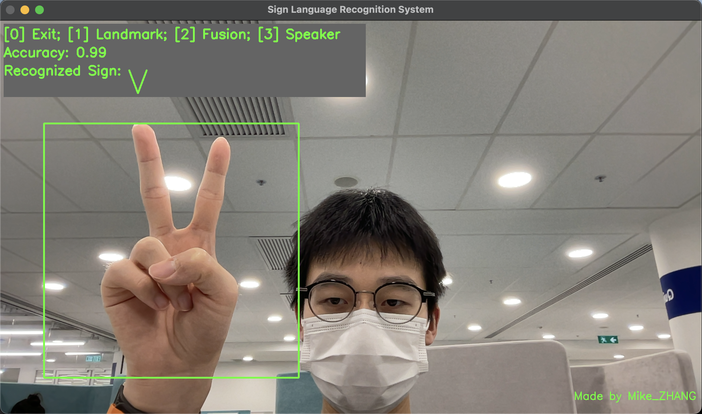
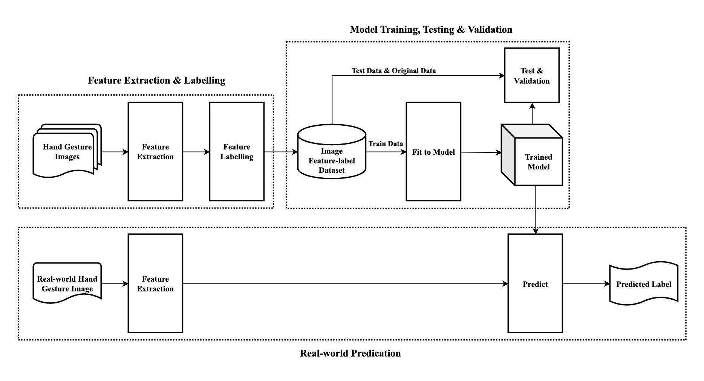
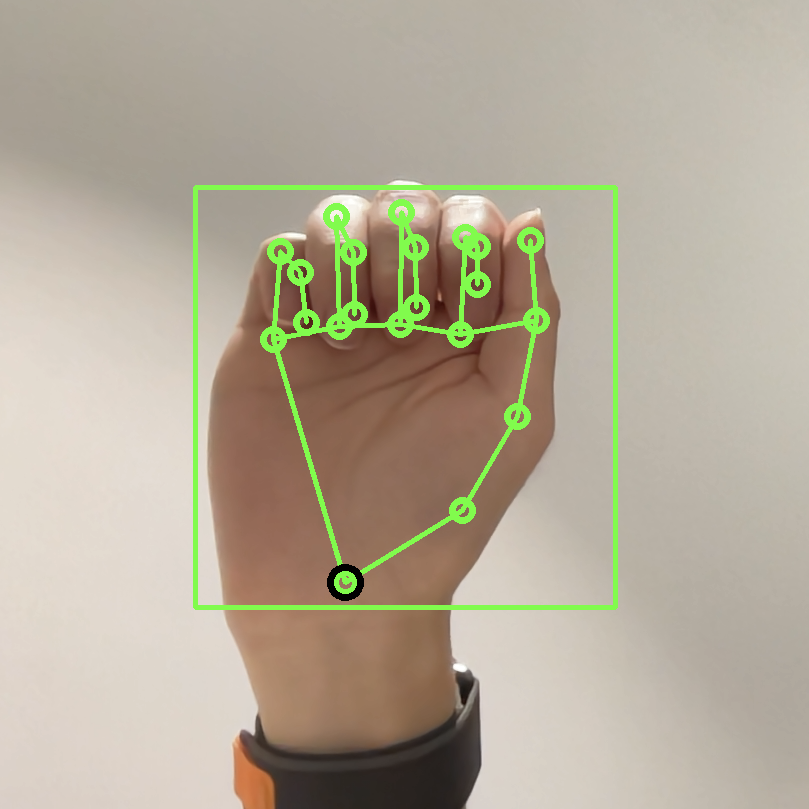
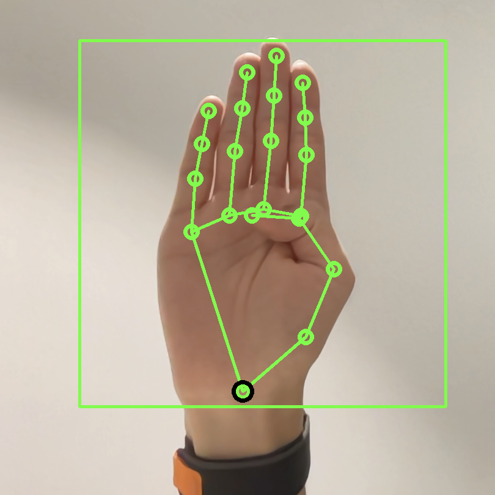
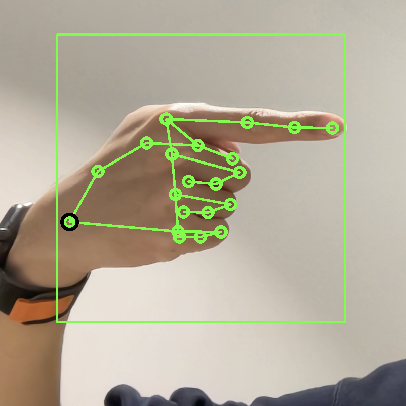
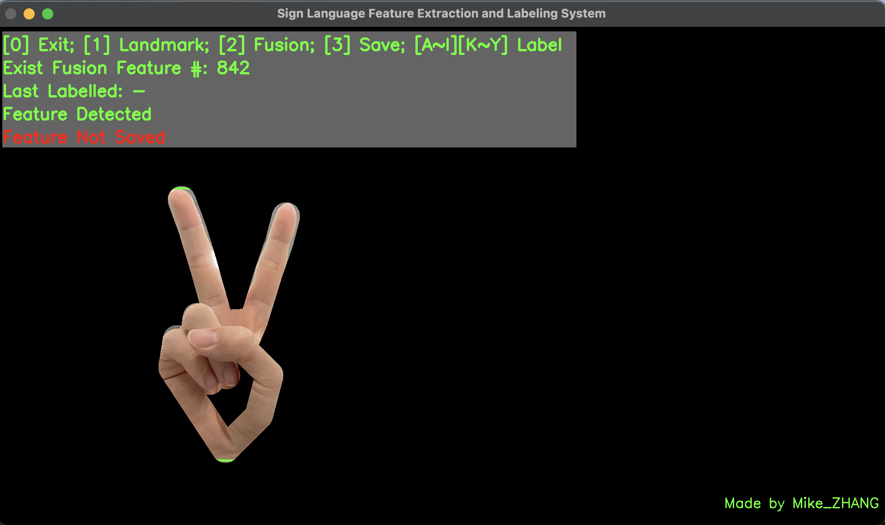

> ***Please carefully read the [Disclaimer of Liability](#disclaimer-of-liability) below first.***  
> All materials in this archive are for reference only. The actual one may vary. 

# Sign_Language_Recognition_SVM
Sign Language Recognition System by Support Vector Machines (SVM)

---

## Introduction

The **Sign Language Recognition System (SLRS)** is developed for a real-world scenario including 24 hand gestures, each representing a distinct letter (excluding letter J and Z). Each hand gesture is assigned with a label as shown below.

Overall, **general method** of the SLRS is shown below. It consists of three parts:
1. **Extracting features** from hand gesture images, **labelling** them with the corresponding gesture letter label, finally, storing them in a dataset.
2. Based on the feature and label dataset, **training** a **SVM (Support Vector Machine) model**, then **validating** and **testing** the model with the dataset.
3. Given a hand gesture image, **extracting features** from it, then using the trained model to **predict** the label of the image.

### ***Step1: Hand Detection and Localization***
After capturing a image containing a hand gesture, then first step is to find where the hand is in the image. I use the **[MediaPipe Hands](https://google.github.io/mediapipe/solutions/hands.html)** to do hand landmark detection. This service will return a **list of 21 coordinates of hand landmarks**. Then, based on the coordinates, I get the **minimum square bounding box** of the hand, which is our **Area of Interest (AOI)** for feature detection, as shown in below.

  

### ***Step2: Feature Extraction***
**Fusion Feature**
This feature is the **fusion** of **Pixel feature** and **Position Feature** of the hand, which takes the list of 21 coordinates of hand landmarks from MediaPipe Hands as input, then draw **white $(255,255,255)$ line segments** between landmarks with a **thickness of 60 pixels** on a **black background image $(0,0,0)$** with a same size as captured image as the black-white ***mask***. Then take the **bitwise AND** operation between the mask and the grey scale original captured image, which results in **pixels on hand only**. Finally, I take the AOI image and **resize** it to $28\times 28$ pixels, and make it divided by $255$ for **normalization**. Then I **flatten** it to a $1\times 784$ np array, saved as **Fusion Feature** (illustrated as non-black part in below).

### ***Step3: Labelling***

- The SLRS contains 24 hand gestures, each representing a distinct letter (excluding letter J and Z). The label mapping is shown as follows:

Letter|a | b | c | d | e | f | g | h | i | k | l | m | n | o | p | q | r | s | t | u | v | w | x | y
-|-|-|-|-|-|-|-|-|-|-|-|-|-|-|-|-|-|-|-|-|-|-|-|-|
Label|1 | 2 | 3 | 4 | 5 | 6 | 7 | 8 | 9 | 11 | 12 | 13 | 14 | 15 | 16 | 17 | 18 | 19 | 20 | 21 | 22 | 23 | 24 | 25
- `Label = ord(Letter) - 96`
- After a hand gesture is detected completely, the user need to **press on the corresponding letter on the keyboard to label the gesture**. The label will be stored in the dataset together with the feature.

### ***Step4: Dataset Splitting***

After extracting **features** from the real-world hand gesture images, and artificially **labelling**, I get about $840$ **self-collected training feature-label data**. The feature-label data is split into **training set** and **testing set** with the ratio of $4:1$.

### ***Step5: Model Training***

Then I choose the **SVM model** (from `sklearn` library) with a **linear kernel** as our classifier, and fit the model with the **training dataset** to get **trained model**.

### ***Step6: Model Testing and Validation***

I use the `metrics.accuracy_score` and `cross_val_score` from `sklearn` package to evaluate the **accuracy** and do the cross **validation** of the model. 

### ***Step7: Model Robustness Testing in Real-world***

Finally, I put the trained model into real-world scenario to test its **robustness**. After capturing **real-world** (left) hand gesture images from camera, I use the same **feature extraction method** as mentioned in ***step 2*** to extract the features from the images, correspondingly to the **trained model**. Then let the model **predict** the label of the image.

- After fitting the Fusion Feature dataset in the **SVM model**, I get the test **accuracy** of $0.99$ and the 5 **validation** scores of $[0.97,0.98,0.99,0.99,0.97]$. 
  - I could tell that the performance of the model ***inside self-collected dataset*** is **good** and **improved**.
- Moreover, in the **real-world scenario**, the performance is still **good**.
  - I could tell that the model is **very robust** in the real-world scenario, and it is independent of the **almost any background**, as well as sensitive to the **similar hand gesture**.

---

## User Manual

## Preparation
1. **Make sure your camera works properly (camera number can be set in line 11, if the programme goes wrong, please change the `CAM_NO` variable)**
2. Make sure following package are install (pip) for python3:
   1. `OpenCV`, `requests-toolbelt`, `numpy`, `pandas`, `sklearn`, `mediapipe`
   2. `gTTS`, `playsound`, `pyttsx3` (these 3 is for text to speech)
3. Python version: 3.9.16
4. [MediaPipe Hands](https://google.github.io/mediapipe/solutions/hands.html) is used for hand landmark detection;
5. The model is only trained on **left hand sign**, please use your **left hand** to test the model.

---

## Train and test

1. Run the programme by
   `python3 trainTest.py`
2. Using your ***left hand*** to sign the gesture in the front of the camera;
3. The prediction result will be shown after the "**Recognizing Sign:**";
4. Press `0` to exit the programme;
5. Press `1` to turn on/off the landmark preview;
6. Press `2` to turn on/off the fusion preview;
7. Press `3` to turn on/off the text to speech;

---

## Extract features and labelling

1. Run the programme by
   `python3 extractLabel.py`
2. Using your ***left hand*** to sign the gesture in the front of the camera;
3. Make sure your full hand is in window ("**Feature Detected**" will be shown);
4. Press corresponding letter on keyboard to label the sign;
5. Last label will be shown after the "**Last Labelled:**";
6. Total labelled data number will be shown after the "**Exist Fusion Feature #:**";
7. Press `3` to save the labelled data ("**Feature Saved**" will be shown after saving);
8. Press `1` to turn on/off the landmark preview;
9.  Press `2` to turn on/off the fusion preview;
10. Press `0` to exit the programme (***make sure you save the data before exit***);

---

## Disclaimer of Liability

**The material and information contained on this website is for general information, reference, and self-learning purposes only. You should not rely upon the material or information on the website as a basis for making any academic, business, legal or any other decisions. You should not copy any material or information on the website into any of your academic, business, legal or any other non-private usages. ZHANG Wengyu will not be responsible for any consequences due to your violations.**

Whilst ZHANG Wengyu endeavours to keep the information up to date and correct, ZHANG Wengyu makes no representations or warranties of any kind, express or implied about the completeness, accuracy, reliability, suitability or availability with respect to the website or the information, products, services or related graphics contained on the website for any purpose. Any reliance you place on such material is therefore strictly at your own risk.

ZHANG Wengyu will not be liable for any false, inaccurate, inappropriate or incomplete information presented on the website.

Although every effort is made to keep the website up and running smoothly, due to the nature of the Internet and the technology involved, ZHANG Wengyu takes no responsibility for and will not be liable for the website being temporarily unavailable due to technical issues (or otherwise) beyond its control or for any loss or damage suffered as a result of the use of or access to, or inability to use or access this website whatsoever.

Certain links in this website will lead to websites which are not under the control of ZHANG Wengyu. When you activate these you will leave ZHANG Wengyu's  website. ZHANG Wengyu has no control over and accepts no liability in respect of materials, products or services available on any website which is not under the control of ZHANG Wengyu.

To the extent not prohibited by law, in no circumstances shall ZHANG Wengyu be liable to you or any other third parties for any loss or damage (including, without limitation, damage for loss of business or loss of profits) arising directly or indirectly from your use of or inability to use, this site or any of the material contained in it.
